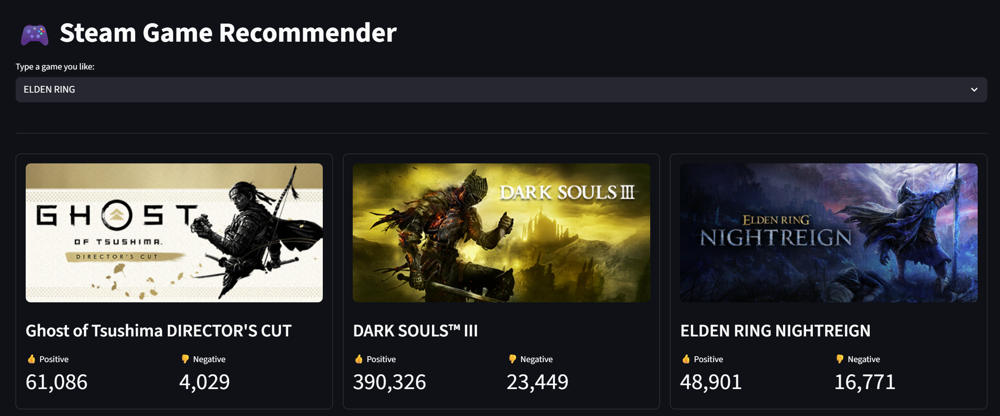

# Steam Discovery Engine

[Launch the Steam Game Recommender](https://video-game-recommender-hhhfbqvwznps9quz5t635e.streamlit.app/)

A high-performance **Hybrid Recommender System** that discovers similar video games across the Steam library. This project goes beyond basic keyword matching by combining high-dimensional text vectorization with statistical quality-weighting.

## Project Overview
The goal of this project was to build a data-driven discovery tool that surfaces relevant, high-quality games. By analyzing a game's genres, categories, and user-defined tags, the engine calculates similarity across thousands of titles in seconds.

## Preview

## Key Technical Features

### 1. Hybrid Recommendation Logic
Instead of relying solely on similarity, the engine implements a **Hybrid Scoring System**:
* **Text Similarity:** Uses **TF-IDF (Term Frequency-Inverse Document Frequency)** to weigh the importance of game tags.
* **Vector Space Modeling:** Calculates **Cosine Similarity** to find the mathematical "distance" between games.
* **Quality Weighting:** Applies a **Bayesian Weighted Rating** to prioritize games with a proven track record, preventing "low-effort" titles from cluttering results.

### 2. Performance & Data Engineering
* **Optimized Storage:** Processes a ~700MB raw JSON dataset and compresses it into a high-speed **Apache Parquet** file, reducing load times and memory footprint by over 90%.
* **Efficient Caching:** Leverages Streamlit’s `@st.cache_resource` to ensure the heavy machine learning models and datasets are loaded into memory only once.

## Tech Stack
* **Core:** Python 3.11
* **Data Science:** Pandas, NumPy, Scikit-Learn
* **File I/O:** PyArrow (Parquet)
* **Frontend:** Streamlit
